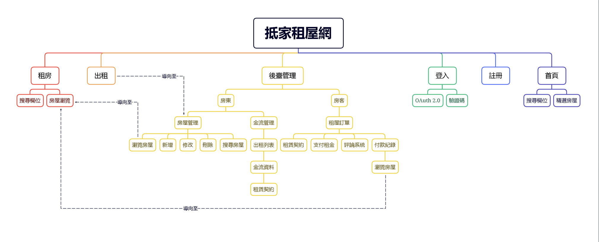
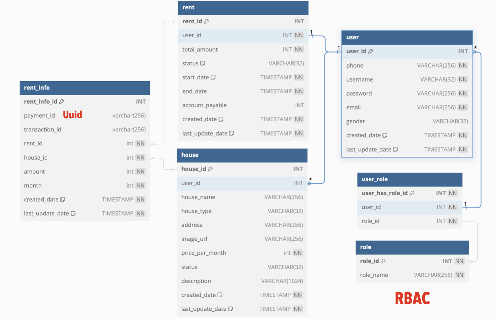

# Get-Home-Web
## 抵家租屋-公開透明的租屋平台
- 開發動機:自身有租屋需求，能有更公開透明的平台供租客與房東做交流
- 特色:前後端分離，jwt無狀態登入，支援第三方支付 (Ex: Line Pay)、評論系統、壓力測試、單元測試
- 功能:租屋、刊登出租訊息、支付租金、分頁顯示、搜尋功能等
- 前端: Vue.js, axios
- 資料庫:MySQL, Redis , H2
- 後端:Spring Boot, Spring Security, OAuth 2.0, Junit5(單元測試)
- 串接第三方API:Line Pay , Google , Imgur
- 其他:RESTful API, JMeter (壓力測試)
- 資安:實作DVWA 模擬XSS攻擊，經測試相同指令專題網站抵家租屋不會被攻擊成功。
---
## 簡報
[pdf](./img/GetHome.pdf)
## Site Map

## ER Model

資料庫(mysql)設計：
- 針對每張表都有一個auto_increment的id，避免人為輸入錯誤，導致資料庫內容被污染。
- 有設置建立時間、修改時間，用於追蹤資料的變更歷史、觀察用戶行為，而且方便管理。
> 以前在銀行時管理報表都有相關的保存年限，以此發想，推估資料庫應該也有保存年限，畢竟如果資料不斷新增，對於開發成本也會隨之增加。
- 針對租屋訂單明細(rent_info)有配置payment_id採用UUID儲存，確保唯一性，為了call第三方支付時使用。
- 針對租屋訂單明細(rent_info)與房屋(house)做left join 使其與house_name 與 image_url關聯，呈現於第三方支付的介面用，並且以利於資料庫簡潔配置。
## 架構圖
(待更新...)
---
